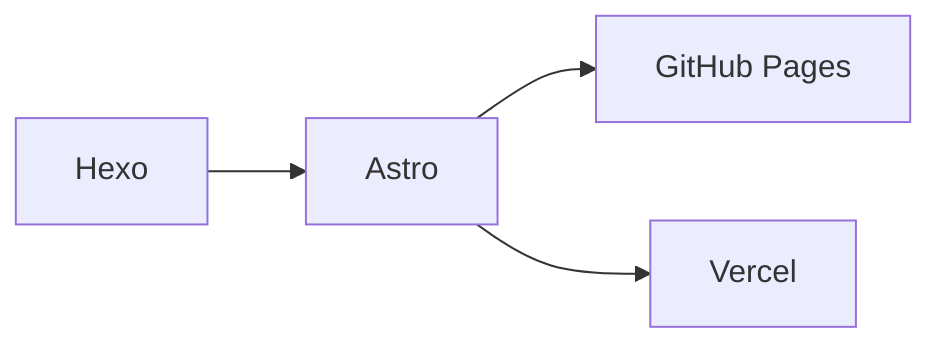

# Hexo to Astro Migration Implementation Plan

> **For agentic workers:** REQUIRED SUB-SKILL: Use superpowers:subagent-driven-development (recommended) or superpowers:executing-plans to implement this plan task-by-task. Steps use checkbox (`- [ ]`) syntax for tracking.

**Goal:** Migrate the "Memory Palace" blog from Hexo 8 + NexT to Astro 5 + AstroPaper v5, with Chinese i18n, sidebar TOC, KaTeX, Mermaid, and dual deployment (GitHub Pages + Vercel).

**Architecture:** Scaffold AstroPaper v5 as a new Astro project in a sibling directory, migrate content and assets, then layer on i18n, TOC, math/diagram support, and a reward component. Each enhancement is an isolated addition to the clean AstroPaper base.

**Tech Stack:** Astro 5, Tailwind CSS v4, TypeScript, Shiki, Pagefind, KaTeX, Mermaid, GitHub Actions, Vercel

**Spec:** `docs/superpowers/specs/2026-04-13-hexo-to-astro-migration-design.md`

---

## File Map

### New files to create

| File | Responsibility |
|------|---------------|
| `src/i18n/types.ts` | Translation key interface |
| `src/i18n/zh.ts` | Chinese translation strings |
| `src/i18n/utils.ts` | `t()` helper function |
| `src/components/TOC.astro` | Sidebar table of contents |
| `src/components/Reward.astro` | Donate/tip QR code component |
| `src/assets/icons/IconZhihu.svg` | Zhihu social icon |
| `src/assets/icons/IconJike.svg` | Jike social icon |
| `src/data/blog/my-1st-post.md` | Migrated post |
| `src/data/blog/AGI-era.md` | Migrated post |
| `src/data/blog/hexo-next-deploy.md` | Migrated post |

### Existing files to modify

| File | Changes |
|------|---------|
| `src/config.ts` | Site metadata (title, author, lang, timezone) |
| `src/constants.ts` | Social links + share links (GitHub, Twitter, Zhihu, Jike, RSS) |
| `astro.config.ts` | Add remarkMath, rehypeKatex, rehypePangu; remove remarkToc/remarkCollapse |
| `src/layouts/PostDetails.astro` | Two-column layout with TOC sidebar; embed Reward component; i18n strings |
| `src/layouts/Layout.astro` | Add KaTeX CSS, Mermaid script, Baidu verification meta |
| `src/components/Header.astro` | Replace English strings with `t()` calls |
| `src/components/Footer.astro` | Replace English strings with `t()` calls |
| `src/components/Pagination.astro` | Replace English strings with `t()` calls |
| `src/components/BackButton.astro` | Replace English strings with `t()` calls |
| `src/components/Breadcrumb.astro` | Replace English strings with `t()` calls |
| `src/components/ShareLinks.astro` | Replace English strings with `t()` calls |
| `src/pages/search.astro` | Replace English strings with `t()` calls |
| `src/pages/404.astro` | Replace English strings with `t()` calls |
| `src/pages/index.astro` | Replace English hero text with Chinese |
| `src/pages/about.md` | Replace with Kevin's about page content |
| `.github/workflows/deploy_hexo.yml` | Rename and update for Astro build + deploy |
| `public/images/` | Copy avatar, QR code images |

---

## Task 1: Scaffold AstroPaper v5 Project

**Files:**
- Create: new Astro project in a temporary directory, then move contents into this repo

- [ ] **Step 1: Scaffold the project**

```bash
cd /tmp
npm create astro@latest -- --template satnaing/astro-paper blog-astro --no-install
```

- [ ] **Step 2: Backup current Hexo files and copy Astro scaffold in**

```bash
cd /Users/kevinlou/Workplace/Projects/blog
# Preserve files we need from Hexo
mkdir -p /tmp/hexo-backup
cp -r source/images /tmp/hexo-backup/ 2>/dev/null || true
cp -r source/_posts /tmp/hexo-backup/
cp source/about/index.md /tmp/hexo-backup/about.md
cp -r .github /tmp/hexo-backup/
cp -r docs /tmp/hexo-backup/

# Remove Hexo files (keep .git, CLAUDE.md, docs)
find . -maxdepth 1 ! -name '.git' ! -name '.' ! -name 'CLAUDE.md' ! -name 'docs' -exec rm -rf {} +

# Copy Astro scaffold in
cp -r /tmp/blog-astro/. .

# Restore docs
cp -r /tmp/hexo-backup/docs .
```

- [ ] **Step 3: Install dependencies**

```bash
npm install
```

- [ ] **Step 4: Verify the scaffold runs**

```bash
npm run dev
# Open http://localhost:4321 — should see default AstroPaper
```

Expected: AstroPaper default page loads with no errors.

- [ ] **Step 5: Commit**

```bash
git add -A
git commit -m "chore: scaffold AstroPaper v5 project (replacing Hexo)"
```

---

## Task 2: Configure Site Metadata

**Files:**
- Modify: `src/config.ts`

- [ ] **Step 1: Update site config**

Replace the contents of `src/config.ts`:

```ts
export const SITE = {
  website: "https://kevin7lou.github.io/blog",
  author: "Kevin Lou",
  profile: "https://github.com/kevin7lou",
  desc: "深度思考，乐于分享",
  title: "Memory Palace",
  ogImage: "og-default.png",
  lightAndDarkMode: true,
  postPerIndex: 4,
  postPerPage: 10,
  scheduledPostMargin: 15 * 60 * 1000,
  showArchives: true,
  showBackButton: true,
  editPost: {
    enabled: false,
    text: "Edit page",
    url: "",
  },
  dynamicOgImage: true,
  dir: "ltr",
  lang: "zh-CN",
  timezone: "Asia/Shanghai",
} as const;
```

- [ ] **Step 2: Verify dev server still runs**

```bash
npm run dev
```

Expected: Site title shows "Memory Palace" in the browser tab.

- [ ] **Step 3: Commit**

```bash
git add src/config.ts
git commit -m "feat: configure site metadata for Memory Palace"
```

---

## Task 3: Migrate Content (3 Posts + About Page)

**Files:**
- Create: `src/data/blog/my-1st-post.md`
- Create: `src/data/blog/AGI-era.md`
- Create: `src/data/blog/hexo-next-deploy.md`
- Modify: `src/pages/about.md`

- [ ] **Step 1: Remove AstroPaper sample posts**

```bash
rm -rf src/data/blog/*.md src/data/blog/examples/ src/data/blog/_releases/
```

- [ ] **Step 2: Create migrated post — my-1st-post.md**

Create `src/data/blog/my-1st-post.md` with transformed front matter:

```markdown
---
title: 这是我的第一篇博客
author: Kevin Lou
pubDatetime: 2022-09-14T01:33:17+08:00
description: 经历了10x年前的博客大巴、新浪博客、WordPress……如今，重新开始折腾之旅。
tags:
  - 朝花夕拾
---

# 重拾"折腾之旅"

经历了10x年前的博客大巴、新浪博客、WordPress……如今，重新开始折腾之旅，现在流行Static Blog。在众多框架中，我选择了[Hexo](https://hexo.io/)以及优雅极简的[Next](https://theme-next.js.org/)主题。

经过反反复复重装和配置，也伴随着开源框架的不断升级，现在上手的成本越来越低，而且在线教程、生态已经做的很好了。希望这次专注在写作上，不要再折腾了。

# 为什么在这里

一开始想要在这世上留下点什么。

但在后来工作中越法觉得，思考深度和写作能力是相辅相成的。「以写代思」逐渐融入我的习惯中。从不写，到写notes，到在这里码字✍️，始终在成长和迭代。

此后，有人开始倡导「Learn in Public」，可能这也是开源文化的一种继承吧，所谓「教学相长」更是促使我不断地学习新知识。

这些年，能走到这里，可能靠着这种持续的学习能力，以及时刻Refresh的精神。希望这些，能对看见此文的您，有所鼓励和帮助。

# 内容方向

首先，构建自我认知体系是个系统工程，需要反复迭代才能螺旋上升。所以，常规知识以链接和笔记形式会记录在我的[Wiki](https://kevin7lou.github.io/wiki/)中。

其次，积累到一定阶段，能够产出长文后，或者是LogSeq不适合的非碎片化内容，我会在这里沉淀。
```

- [ ] **Step 3: Create migrated post — AGI-era.md**

Create `src/data/blog/AGI-era.md`. Copy the full markdown body from the original Hexo post (`/tmp/hexo-backup/_posts/AGI-era.md`), replacing only the front matter:

```yaml
---
title: AGI Era
author: Kevin Lou
pubDatetime: 2023-04-24T21:32:17+08:00
description: 22年年底了解到AIGC这个概念大为震撼！经过近半年的技术演进，对AGI的未来有以下观点和思考。
tags:
  - AGI
  - 科技洪流
---
```

Remove `<!--more-->` from the body. Keep all other markdown content as-is.

- [ ] **Step 4: Create migrated post — hexo-next-deploy.md**

Create `src/data/blog/hexo-next-deploy.md`:

```markdown
---
title: 基于Hexo和Next-theme部署Github Page所踩过的坑
author: Kevin Lou
pubDatetime: 2024-03-26T23:06:17+08:00
description: git clone next-theme发布到GitHub Pages时遇到的blank page问题和解决方案。
tags:
  - Hexo
  - Next-theme
  - 科技洪流
---

- git clone next-theme发布到netflix的时候会出现blank page
```

- [ ] **Step 5: Update about page**

Replace `src/pages/about.md` content:

```markdown
---
layout: ../layouts/AboutLayout.astro
title: "关于"
---

# Kevin Lou

深度思考，乐于分享。

如鹰展翅上腾（赛 40:31）

## 链接

- [GitHub](https://github.com/kevin7lou)
- [Twitter](https://twitter.com/kevin7lou)
- [知乎](https://www.zhihu.com/people/kevin7lou)
- [即刻](https://okjk.co/sCWqF2)
- [Wiki](https://kevin7lou.github.io/wiki/)
```

- [ ] **Step 6: Verify posts render**

```bash
npm run dev
```

Expected: Home page shows 3 posts. Clicking each post renders the full content.

- [ ] **Step 7: Commit**

```bash
git add src/data/blog/ src/pages/about.md
git commit -m "feat: migrate 3 blog posts and about page from Hexo"
```

---

## Task 4: Copy Static Assets

**Files:**
- Create: `public/images/avatar.gif`, `public/images/wechatpay.png`, `public/images/alipay.png`, `public/images/paypal.png`, `public/images/bitcoin.png`, `public/images/wechat_channel.png`

- [ ] **Step 1: Copy images from Hexo backup**

```bash
mkdir -p public/images
cp /tmp/hexo-backup/images/avatar.gif public/images/ 2>/dev/null || echo "avatar.gif not found in backup — check source/images/ in git history"
cp /tmp/hexo-backup/images/wechatpay.png public/images/ 2>/dev/null || true
cp /tmp/hexo-backup/images/alipay.png public/images/ 2>/dev/null || true
cp /tmp/hexo-backup/images/paypal.png public/images/ 2>/dev/null || true
cp /tmp/hexo-backup/images/bitcoin.png public/images/ 2>/dev/null || true
cp /tmp/hexo-backup/images/wechat_channel.png public/images/ 2>/dev/null || true
```

Note: If images are missing from the backup, retrieve them from git history: `git show HEAD:source/images/avatar.gif > public/images/avatar.gif`

- [ ] **Step 2: Commit**

```bash
git add public/images/
git commit -m "feat: migrate static image assets"
```

---

## Task 5: Chinese i18n

**Files:**
- Create: `src/i18n/types.ts`
- Create: `src/i18n/zh.ts`
- Create: `src/i18n/utils.ts`
- Modify: `src/components/Header.astro` (replace hardcoded strings)
- Modify: `src/components/Footer.astro`
- Modify: `src/components/Pagination.astro`
- Modify: `src/components/BackButton.astro`
- Modify: `src/components/Breadcrumb.astro`
- Modify: `src/components/ShareLinks.astro`
- Modify: `src/layouts/PostDetails.astro`
- Modify: `src/pages/search.astro`
- Modify: `src/pages/404.astro`
- Modify: `src/pages/index.astro`

- [ ] **Step 1: Create translation types**

Create `src/i18n/types.ts`:

```ts
export interface I18nStrings {
  // Navigation
  "nav.skipToContent": string;
  "nav.posts": string;
  "nav.tags": string;
  "nav.about": string;
  "nav.archives": string;
  "nav.search": string;
  "nav.toggleTheme": string;
  "nav.openMenu": string;
  "nav.closeMenu": string;

  // Post
  "post.prevPost": string;
  "post.nextPost": string;
  "post.share": string;
  "post.copy": string;
  "post.copied": string;
  "post.toc": string;
  "post.goBack": string;

  // Pagination
  "pagination.prev": string;
  "pagination.next": string;
  "pagination.nav": string;
  "pagination.gotoPrev": string;
  "pagination.gotoNext": string;

  // Breadcrumb
  "breadcrumb.home": string;

  // Search
  "search.title": string;
  "search.desc": string;

  // Index
  "index.featured": string;
  "index.recentPosts": string;
  "index.allPosts": string;

  // 404
  "error.notFound": string;
  "error.notFoundDesc": string;
  "error.goHome": string;

  // Footer
  "footer.copyright": string;
  "footer.allRightsReserved": string;
}
```

- [ ] **Step 2: Create Chinese translations**

Create `src/i18n/zh.ts`:

```ts
import type { I18nStrings } from "./types";

export const zh: I18nStrings = {
  // Navigation
  "nav.skipToContent": "跳至内容",
  "nav.posts": "文章",
  "nav.tags": "标签",
  "nav.about": "关于",
  "nav.archives": "归档",
  "nav.search": "搜索",
  "nav.toggleTheme": "切换明暗模式",
  "nav.openMenu": "打开菜单",
  "nav.closeMenu": "关闭菜单",

  // Post
  "post.prevPost": "上一篇",
  "post.nextPost": "下一篇",
  "post.share": "分享此文：",
  "post.copy": "复制",
  "post.copied": "已复制",
  "post.toc": "目录",
  "post.goBack": "返回",

  // Pagination
  "pagination.prev": "上一页",
  "pagination.next": "下一页",
  "pagination.nav": "分页导航",
  "pagination.gotoPrev": "前往上一页",
  "pagination.gotoNext": "前往下一页",

  // Breadcrumb
  "breadcrumb.home": "首页",

  // Search
  "search.title": "搜索",
  "search.desc": "搜索任意文章...",

  // Index
  "index.featured": "精选文章",
  "index.recentPosts": "最近文章",
  "index.allPosts": "全部文章",

  // 404
  "error.notFound": "页面未找到",
  "error.notFoundDesc": "404 — 你访问的页面不存在",
  "error.goHome": "返回首页",

  // Footer
  "footer.copyright": "版权所有",
  "footer.allRightsReserved": "保留所有权利。",
};
```

- [ ] **Step 3: Create translation utility**

Create `src/i18n/utils.ts`:

```ts
import { zh } from "./zh";
import type { I18nStrings } from "./types";

const translations: I18nStrings = zh;

export function t(key: keyof I18nStrings): string {
  return translations[key];
}
```

- [ ] **Step 4: Replace strings in Header.astro**

In `src/components/Header.astro`, add import at top of frontmatter:

```ts
import { t } from "@/i18n/utils";
```

Then replace these strings in the template:
- `"Skip to content"` → `{t("nav.skipToContent")}`
- `"Posts"` → `{t("nav.posts")}`
- `"Tags"` → `{t("nav.tags")}`
- `"About"` → `{t("nav.about")}`
- `"Archives"` → `{t("nav.archives")}`
- `"Search"` (visible text and aria-label) → `{t("nav.search")}`
- `"Toggles light & dark"` → `{t("nav.toggleTheme")}`
- `"Open Menu"` / `"Close Menu"` → `{t("nav.openMenu")}` / `{t("nav.closeMenu")}`

- [ ] **Step 5: Replace strings in remaining components**

Apply the same pattern (import `t`, replace hardcoded strings) in these files:

| File | Strings to replace |
|------|-------------------|
| `Footer.astro` | `"Copyright"` → `t("footer.copyright")`, `"All rights reserved."` → `t("footer.allRightsReserved")` |
| `Pagination.astro` | `"Prev"` → `t("pagination.prev")`, `"Next"` → `t("pagination.next")`, aria-labels |
| `BackButton.astro` | `"Go back"` → `t("post.goBack")` |
| `Breadcrumb.astro` | `"Home"` → `t("breadcrumb.home")` |
| `ShareLinks.astro` | `"Share this post on:"` → `t("post.share")` |
| `PostDetails.astro` | `"Previous Post"` → `t("post.prevPost")`, `"Next Post"` → `t("post.nextPost")` |
| `search.astro` | `"Search"` → `t("search.title")`, `"Search any article ..."` → `t("search.desc")` |
| `404.astro` | `"Page Not Found"` → `t("error.notFound")`, `"Go back home"` → `t("error.goHome")` |
| `index.astro` | `"Featured"` → `t("index.featured")`, `"Recent Posts"` → `t("index.recentPosts")`, `"All Posts"` → `t("index.allPosts")`, replace English hero text with Chinese intro |

- [ ] **Step 6: Update copy/copied in PostDetails.astro inline script**

In `src/layouts/PostDetails.astro`, find the inline `<script>` that handles copy-to-clipboard. Replace the hardcoded `"Copy"` and `"Copied"` strings with `"复制"` and `"已复制"` (since inline scripts don't have access to the `t()` function, use the Chinese strings directly).

- [ ] **Step 7: Verify all pages show Chinese UI**

```bash
npm run dev
```

Visit: Home, About, Tags, Search, a post page, 404. All navigation and UI labels should be in Chinese.

- [ ] **Step 8: Commit**

```bash
git add src/i18n/ src/components/ src/layouts/ src/pages/
git commit -m "feat: add Chinese i18n for all UI strings"
```

---

## Task 6: CJK Typography (Pangu)

**Files:**
- Modify: `astro.config.ts`
- Modify: `package.json` (new dependency)

- [ ] **Step 1: Install rehype-pangu**

```bash
npm install rehype-pangu
```

If `rehype-pangu` is not available, use the alternative:

```bash
npm install pangu
```

And create a custom rehype plugin instead (see step 2 alternative).

- [ ] **Step 2: Add to Astro config**

In `astro.config.ts`, add import and plugin:

```ts
import rehypePangu from "rehype-pangu";
```

Add `rehypePlugins` to the `markdown` config:

```ts
markdown: {
  remarkPlugins: [/* existing */],
  rehypePlugins: [rehypePangu],
  // ...existing shikiConfig
},
```

- [ ] **Step 3: Verify CJK spacing**

```bash
npm run dev
```

Open a post with mixed Chinese/English text. Spaces should appear between CJK and Latin characters.

- [ ] **Step 4: Commit**

```bash
git add astro.config.ts package.json package-lock.json
git commit -m "feat: add rehype-pangu for CJK typography spacing"
```

---

## Task 7: Sidebar TOC

**Files:**
- Create: `src/components/TOC.astro`
- Modify: `src/layouts/PostDetails.astro`
- Modify: `astro.config.ts` (remove remark-toc/remark-collapse)

- [ ] **Step 1: Remove inline TOC plugins**

In `astro.config.ts`, remove `remarkToc` and `remarkCollapse` from `remarkPlugins`:

```ts
// Before:
remarkPlugins: [remarkToc, [remarkCollapse, { test: "Table of contents" }]],

// After:
remarkPlugins: [],
```

Also remove the imports:

```ts
// Remove these lines:
import remarkToc from "remark-toc";
import remarkCollapse from "remark-collapse";
```

- [ ] **Step 2: Create TOC component**

Create `src/components/TOC.astro`:

```astro
---
import { t } from "@/i18n/utils";

interface Heading {
  depth: number;
  slug: string;
  text: string;
}

interface Props {
  headings: Heading[];
}

const { headings } = Astro.props;
const filteredHeadings = headings.filter(h => h.depth >= 2 && h.depth <= 4);
---

{filteredHeadings.length > 0 && (
  <nav class="toc-sidebar">
    {/* Mobile: collapsible */}
    <details class="lg:hidden mb-6">
      <summary class="cursor-pointer font-medium text-accent">
        {t("post.toc")}
      </summary>
      <ul class="mt-2 space-y-1 text-sm">
        {filteredHeadings.map(heading => (
          <li style={`padding-left: ${(heading.depth - 2) * 0.75}rem`}>
            <a href={`#${heading.slug}`} class="text-foreground/70 hover:text-accent">
              {heading.text}
            </a>
          </li>
        ))}
      </ul>
    </details>

    {/* Desktop: sticky sidebar */}
    <div class="hidden lg:block sticky top-20 max-h-[calc(100vh-6rem)] overflow-y-auto">
      <h2 class="mb-3 text-sm font-semibold uppercase tracking-wide text-foreground/50">
        {t("post.toc")}
      </h2>
      <ul class="space-y-1.5 text-sm border-l border-border pl-3">
        {filteredHeadings.map(heading => (
          <li style={`padding-left: ${(heading.depth - 2) * 0.75}rem`}>
            <a
              href={`#${heading.slug}`}
              class="toc-link block text-foreground/60 hover:text-accent transition-colors"
              data-slug={heading.slug}
            >
              {heading.text}
            </a>
          </li>
        ))}
      </ul>
    </div>
  </nav>
)}

<script>
  function initTOC() {
    const tocLinks = document.querySelectorAll<HTMLAnchorElement>(".toc-link");
    if (tocLinks.length === 0) return;

    const observer = new IntersectionObserver(
      entries => {
        for (const entry of entries) {
          if (entry.isIntersecting) {
            tocLinks.forEach(link => link.classList.remove("text-accent", "font-medium"));
            const activeLink = document.querySelector(
              `.toc-link[data-slug="${entry.target.id}"]`
            );
            activeLink?.classList.add("text-accent", "font-medium");
          }
        }
      },
      { rootMargin: "0px 0px -80% 0px", threshold: 0 }
    );

    tocLinks.forEach(link => {
      const slug = link.dataset.slug;
      if (slug) {
        const heading = document.getElementById(slug);
        if (heading) observer.observe(heading);
      }
    });
  }

  initTOC();
  document.addEventListener("astro:after-swap", initTOC);
</script>
```

- [ ] **Step 3: Modify PostDetails.astro for two-column layout**

In `src/layouts/PostDetails.astro`:

Add import in frontmatter:

```ts
import TOC from "@/components/TOC.astro";
```

Extract headings from render:

```ts
// Change:
const { Content } = await render(post);
// To:
const { Content, headings } = await render(post);
```

Wrap the `<main>` content area in a two-column grid. Find the `<main>` tag and restructure:

```astro
<main
  id="main-content"
  class:list={["pb-12", { "mt-8": !SITE.showBackButton }]}
>
  <div class="app-layout">
    <h1 ...>{title}</h1>
    <div class="my-2 ..."><!-- datetime + edit --></div>
  </div>

  <div class="app-layout lg:grid lg:grid-cols-[1fr_200px] lg:gap-8">
    <div>
      <article id="article" class="app-prose mt-8 ..." data-pagefind-body>
        <Content />
      </article>

      <hr class="my-8 border-dashed" />
      <!-- tags, share, prev/next — keep existing code here -->
    </div>

    <aside class="hidden lg:block mt-8">
      <TOC headings={headings} />
    </aside>
  </div>

  {/* Mobile TOC — shown above article on small screens */}
  <div class="app-layout lg:hidden mt-4">
    <TOC headings={headings} />
  </div>
</main>
```

Note: The exact restructuring depends on the current HTML structure. The key change is wrapping `<article>` and the TOC `<aside>` in a `lg:grid` container.

- [ ] **Step 4: Verify TOC**

```bash
npm run dev
```

Open the AGI-era post (it has multiple headings). Desktop: TOC visible in right sidebar, sticky on scroll, highlights active heading. Mobile: TOC collapsed above article.

- [ ] **Step 5: Commit**

```bash
git add src/components/TOC.astro src/layouts/PostDetails.astro astro.config.ts
git commit -m "feat: add responsive sidebar TOC with scroll highlighting"
```

---

## Task 8: KaTeX Math Support

**Files:**
- Modify: `astro.config.ts`
- Modify: `src/layouts/Layout.astro`
- Modify: `package.json` (new dependencies)

- [ ] **Step 1: Install dependencies**

```bash
npm install remark-math rehype-katex
```

- [ ] **Step 2: Add plugins to Astro config**

In `astro.config.ts`, add imports:

```ts
import remarkMath from "remark-math";
import rehypeKatex from "rehype-katex";
```

Update the markdown config:

```ts
markdown: {
  remarkPlugins: [remarkMath],
  rehypePlugins: [rehypePangu, rehypeKatex],
  // ...existing shikiConfig
},
```

- [ ] **Step 3: Add KaTeX CSS to Layout.astro**

In `src/layouts/Layout.astro`, add inside `<head>`:

```html
<link
  rel="stylesheet"
  href="https://cdn.jsdelivr.net/npm/katex@0.16/dist/katex.min.css"
  crossorigin="anonymous"
/>
```

- [ ] **Step 4: Test with a math snippet**

Add a test block to any post temporarily:

```markdown
Inline math: $E = mc^2$

Block math:

$$
\int_{-\infty}^{\infty} e^{-x^2} dx = \sqrt{\pi}
$$
```

```bash
npm run dev
```

Expected: Math renders correctly with KaTeX styling.

- [ ] **Step 5: Remove test math snippet, commit**

```bash
git add astro.config.ts src/layouts/Layout.astro package.json package-lock.json
git commit -m "feat: add KaTeX math formula support"
```

---

## Task 9: Mermaid Diagram Support

**Files:**
- Modify: `src/layouts/Layout.astro`

- [ ] **Step 1: Add Mermaid client-side script to Layout.astro**

In `src/layouts/Layout.astro`, add before `</body>`:

```html
<script>
  async function initMermaid() {
    const mermaidBlocks = document.querySelectorAll("pre > code.language-mermaid");
    if (mermaidBlocks.length === 0) return;

    const { default: mermaid } = await import("https://cdn.jsdelivr.net/npm/mermaid@11/dist/mermaid.esm.min.mjs");

    const isDark = document.documentElement.dataset.theme === "dark";
    mermaid.initialize({
      startOnLoad: false,
      theme: isDark ? "dark" : "default",
    });

    for (const block of mermaidBlocks) {
      const pre = block.parentElement;
      if (!pre) continue;
      const container = document.createElement("div");
      container.classList.add("mermaid");
      container.textContent = block.textContent ?? "";
      pre.replaceWith(container);
    }

    await mermaid.run({ querySelector: ".mermaid" });
  }

  initMermaid();
  document.addEventListener("astro:after-swap", initMermaid);
</script>
```

- [ ] **Step 2: Test with a Mermaid diagram**

Add to any post temporarily:

````markdown

````

```bash
npm run dev
```

Expected: Mermaid diagram renders as SVG. Toggle dark mode — theme should match.

- [ ] **Step 3: Remove test diagram, commit**

```bash
git add src/layouts/Layout.astro
git commit -m "feat: add Mermaid diagram support via client-side rendering"
```

---

## Task 10: Reward (Donate) Component

**Files:**
- Create: `src/components/Reward.astro`
- Modify: `src/layouts/PostDetails.astro`

- [ ] **Step 1: Create Reward component**

Create `src/components/Reward.astro`:

```astro
---
interface Props {
  class?: string;
}

const { class: className } = Astro.props;

const rewards = [
  { name: "WeChat Pay", image: "/images/wechatpay.png" },
  { name: "Alipay", image: "/images/alipay.png" },
  { name: "PayPal", image: "/images/paypal.png" },
  { name: "Bitcoin", image: "/images/bitcoin.png" },
];
---

<details class:list={["group", className]}>
  <summary class="cursor-pointer list-none text-center">
    <span class="inline-block rounded-lg border border-accent/30 px-4 py-2 text-sm text-accent hover:bg-accent/10 transition-colors">
      ☕ 请我喝杯咖啡
    </span>
  </summary>
  <div class="mt-4 grid grid-cols-2 gap-4 sm:grid-cols-4">
    {rewards.map(({ name, image }) => (
      <div class="flex flex-col items-center gap-2">
        
        <span class="text-xs text-foreground/60">{name}</span>
      </div>
    ))}
  </div>
</details>
```

- [ ] **Step 2: Embed in PostDetails.astro**

In `src/layouts/PostDetails.astro`, add import:

```ts
import Reward from "@/components/Reward.astro";
```

Add `<Reward />` after the tags list and before `<BackToTopButton />`:

```astro
<ul class="mt-4 mb-8 flex flex-wrap gap-4 sm:my-8">
  {tags.map(tag => <Tag ... />)}
</ul>

<Reward class="my-8" />

<BackToTopButton />
```

- [ ] **Step 3: Verify**

```bash
npm run dev
```

Open any post. "请我喝杯咖啡" button should appear. Clicking it expands to show QR code grid.

- [ ] **Step 4: Commit**

```bash
git add src/components/Reward.astro src/layouts/PostDetails.astro
git commit -m "feat: add reward/donate component with QR codes"
```

---

## Task 11: Custom Social Icons (Zhihu + Jike)

**Files:**
- Create: `src/assets/icons/IconZhihu.svg`
- Create: `src/assets/icons/IconJike.svg`
- Modify: `src/constants.ts`

- [ ] **Step 1: Create Zhihu SVG icon**

Create `src/assets/icons/IconZhihu.svg`:

```svg
<svg xmlns="http://www.w3.org/2000/svg" width="24" height="24" viewBox="0 0 24 24" fill="none" stroke="currentColor" stroke-width="2" stroke-linecap="round" stroke-linejoin="round">
  <path d="M5.8 11.3 2 22l6.7-3.8L5.8 11.3Z"/>
  <path d="M3 3h8v12.5H3z"/>
  <path d="M13 3h8l-2 8h-3.5L13 22l5-11"/>
</svg>
```

Note: This is a simplified Zhihu-style icon. For the official Zhihu logo, source the SVG from the Zhihu brand kit or a reputable icon library (e.g., Simple Icons).

- [ ] **Step 2: Create Jike SVG icon**

Create `src/assets/icons/IconJike.svg`:

```svg
<svg xmlns="http://www.w3.org/2000/svg" width="24" height="24" viewBox="0 0 24 24" fill="none" stroke="currentColor" stroke-width="2" stroke-linecap="round" stroke-linejoin="round">
  <circle cx="12" cy="12" r="10"/>
  <path d="M8 12h8"/>
  <path d="M12 8v8"/>
</svg>
```

Note: Same as above — source the official Jike icon SVG for production use. The above is a placeholder shape.

- [ ] **Step 3: Update constants.ts**

Replace the `SOCIALS` array in `src/constants.ts`:

```ts
import IconGitHub from "@/assets/icons/IconGitHub.svg";
import IconBrandX from "@/assets/icons/IconBrandX.svg";
import IconZhihu from "@/assets/icons/IconZhihu.svg";
import IconJike from "@/assets/icons/IconJike.svg";
import IconRss from "@/assets/icons/IconRss.svg";
import { SITE } from "@/config";

// Remove unused icon imports (LinkedIn, Mail, etc.)

export const SOCIALS = [
  {
    name: "GitHub",
    href: "https://github.com/kevin7lou",
    linkTitle: `${SITE.title} on GitHub`,
    icon: IconGitHub,
  },
  {
    name: "Twitter",
    href: "https://twitter.com/kevin7lou",
    linkTitle: `${SITE.title} on Twitter`,
    icon: IconBrandX,
  },
  {
    name: "知乎",
    href: "https://www.zhihu.com/people/kevin7lou",
    linkTitle: `${SITE.title} on 知乎`,
    icon: IconZhihu,
  },
  {
    name: "即刻",
    href: "https://okjk.co/sCWqF2",
    linkTitle: `${SITE.title} on 即刻`,
    icon: IconJike,
  },
  {
    name: "RSS",
    href: "/rss.xml",
    linkTitle: `${SITE.title} RSS Feed`,
    icon: IconRss,
  },
] as const;
```

Keep the `SHARE_LINKS` array as-is (or trim to only the platforms you use).

- [ ] **Step 4: Verify footer social icons**

```bash
npm run dev
```

Footer should show 5 social icons: GitHub, Twitter, 知乎, 即刻, RSS.

- [ ] **Step 5: Commit**

```bash
git add src/assets/icons/IconZhihu.svg src/assets/icons/IconJike.svg src/constants.ts
git commit -m "feat: add Zhihu and Jike social icons"
```

---

## Task 12: SEO + Google Analytics

**Files:**
- Modify: `src/layouts/Layout.astro`
- Create or modify: `.env`

- [ ] **Step 1: Add Baidu verification meta tag**

In `src/layouts/Layout.astro`, add inside `<head>` after the Google verification meta:

```html
<meta name="baidu-site-verification" content="sq1edMb0bN" />
```

- [ ] **Step 2: Set Google verification via env var**

AstroPaper already supports `PUBLIC_GOOGLE_SITE_VERIFICATION` env var. Create `.env`:

```
PUBLIC_GOOGLE_SITE_VERIFICATION=uKuWVhKqZwEufCjkmJ75A7eiCwdkY6DhTsH_OnEtYBk
```

Add `.env` to `.gitignore` if not already there. For deployment, set this env var in Vercel / GitHub Actions secrets.

- [ ] **Step 3: Add Google Analytics**

In `src/layouts/Layout.astro`, add inside `<head>`:

```html
<script
  is:inline
  async
  src="https://www.googletagmanager.com/gtag/js?id=G-5QBCB3V0H2"
></script>
<script is:inline>
  window.dataLayer = window.dataLayer || [];
  function gtag() { dataLayer.push(arguments); }
  gtag("js", new Date());
  gtag("config", "G-5QBCB3V0H2");
</script>
```

Note: Using `is:inline` ensures the script is not bundled by Astro. For better performance, consider `@astrojs/partytown` to offload GA to a web worker — but start with the simple approach.

- [ ] **Step 4: Verify**

```bash
npm run build
```

Check `dist/index.html` for the GA script and both verification meta tags.

- [ ] **Step 5: Commit**

```bash
git add src/layouts/Layout.astro .env
git commit -m "feat: add Google Analytics and search verification meta tags"
```

---

## Task 13: GitHub Actions Deployment

**Files:**
- Modify: `.github/workflows/deploy_hexo.yml` → rename to `.github/workflows/deploy.yml`

- [ ] **Step 1: Update the workflow file**

Delete the old file and create `.github/workflows/deploy.yml`:

```yaml
name: Deploy Astro to GitHub Pages

on:
  push:
    branches:
      - master

env:
  TZ: Asia/Shanghai

jobs:
  deploy:
    runs-on: ubuntu-latest
    steps:
      - name: Checkout Code
        uses: actions/checkout@v4

      - name: Setup Node.js
        uses: actions/setup-node@v4
        with:
          node-version: "20"
          cache: "npm"

      - name: Install Dependencies
        run: npm ci

      - name: Build
        run: npm run build
        env:
          PUBLIC_GOOGLE_SITE_VERIFICATION: ${{ secrets.PUBLIC_GOOGLE_SITE_VERIFICATION }}

      - name: Run Pagefind
        run: npx pagefind --site dist

      - name: Deploy to GitHub Pages
        uses: peaceiris/actions-gh-pages@v4
        with:
          github_token: ${{ secrets.GITHUB_TOKEN }}
          publish_dir: ./dist
```

- [ ] **Step 2: Remove old workflow**

```bash
rm -f .github/workflows/deploy_hexo.yml
```

- [ ] **Step 3: Commit**

```bash
git add .github/workflows/
git commit -m "ci: update GitHub Actions workflow for Astro deployment"
```

---

## Task 14: Update CLAUDE.md

**Files:**
- Modify: `CLAUDE.md`

- [ ] **Step 1: Update CLAUDE.md for the new Astro project**

Replace the contents of `CLAUDE.md` to reflect the new tech stack:

```markdown
# CLAUDE.md

This file provides guidance to Claude Code (claude.ai/code) when working with code in this repository.

## Project Overview

Personal blog ("Memory Palace") powered by Astro 5 + AstroPaper v5 theme, deployed to GitHub Pages and Vercel.

- **Site URL:** https://kevin7lou.github.io/blog
- **Author:** Kevin Lou
- **Language:** zh-CN (Chinese content, Chinese UI)

## Commands

\`\`\`bash
npm run dev       # Local dev server (http://localhost:4321)
npm run build     # Generate static site to ./dist
npm run preview   # Preview built site locally
\`\`\`

Create a new post:
- Add a `.md` file in `src/data/blog/` with the required front matter schema

## Architecture

### Tech Stack

Astro 5 + Tailwind CSS v4 + TypeScript + Shiki + Pagefind. Zero framework dependencies (no React/Svelte/Vue).

### Key Directories

- `src/data/blog/` — Blog posts (Markdown with Zod-validated front matter)
- `src/components/` — Astro components (Header, Footer, TOC, Reward, etc.)
- `src/layouts/` — Page layouts (Layout.astro base, PostDetails.astro for posts)
- `src/i18n/` — Chinese UI translations (zh.ts + t() helper)
- `src/pages/` — File-based routing
- `src/config.ts` — Site metadata (title, author, lang, timezone)
- `src/constants.ts` — Social links and share links
- `public/images/` — Static assets (avatar, QR codes)

### Content Collection

Posts use Astro Content Layer API with glob loader. Schema defined in `src/content.config.ts`. Required front matter: `title`, `pubDatetime`, `description`, `tags`.

### Markdown Pipeline

- **Code highlighting:** Shiki with diff/highlight/word-highlight/fileName transformers
- **Math:** remark-math + rehype-katex (KaTeX)
- **Diagrams:** Mermaid via client-side rendering
- **CJK spacing:** rehype-pangu

### Deployment

Push to `master` triggers `.github/workflows/deploy.yml`:
1. Node 20, `npm ci`, `npm run build`
2. `npx pagefind --site dist` (search index)
3. Publish `dist/` to `gh-pages` branch

Also deployed to Vercel (auto-detected Astro framework, zero config).
\`\`\`
```

- [ ] **Step 2: Commit**

```bash
git add CLAUDE.md
git commit -m "docs: update CLAUDE.md for Astro migration"
```

---

## Task 15: Final Verification

- [ ] **Step 1: Full build**

```bash
npm run build
```

Expected: Build succeeds with zero errors.

- [ ] **Step 2: Run Pagefind indexing**

```bash
npx pagefind --site dist
```

Expected: Index generated, Chinese content indexed.

- [ ] **Step 3: Preview and test all pages**

```bash
npm run preview
```

Test checklist:
- Home page: shows 3 posts with Chinese UI
- Post page: content renders, TOC sidebar works, reward button expands, share links present
- Tags page: lists all tags
- Search: type Chinese keywords, results appear
- About page: content renders
- Dark mode: toggle works across all pages, Mermaid diagrams adapt
- 404 page: shows Chinese error message
- Footer: social icons (GitHub, Twitter, 知乎, 即刻, RSS) all clickable

- [ ] **Step 4: Lighthouse audit**

Open Chrome DevTools → Lighthouse. Run audit on home page and a post page.

Target: 95+ on Performance, Accessibility, Best Practices, SEO.

- [ ] **Step 5: Final commit if any fixes needed**

```bash
git add -A
git commit -m "fix: address issues found during final verification"
```
